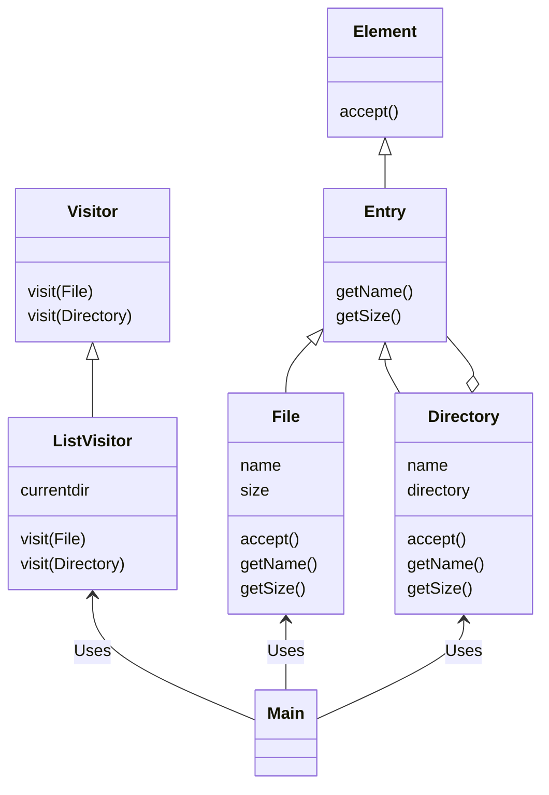

```mermaid
classDiagram
    Visitor <|-- ListVisitor
    Element <|-- Entry
    Entry <|-- File
    Entry <|-- Directory
    ListVisitor <-- Main : Uses
    File <-- Main : Uses
    Directory <-- Main : Uses
    Entry --o Directory
    class Visitor{
        visit(File)
        visit(Directory)
    }
    class ListVisitor{
	    currentdir
        visit(File)
        visit(Directory)
    }
    class Element {
		accept()
	}
    class Entry {
	    getName()
	    getSize()
    }
    class File {
	    name
	    size
	    accept()
	    getName()
	    getSize()
    }
    class Directory {
	    name
	    directory
	    accept()
	    getName()
	    getSize()
    }
```
